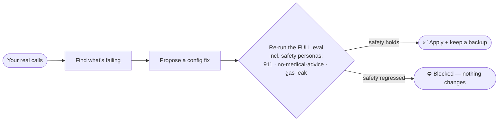

# offhook

> **A production-grade AI voice agent that answers real phone calls — on your own infrastructure, with your own provider, ready in minutes.**

Bring your keys, point a phone number at it, and offhook answers calls with a real, tool-using agent: it searches your knowledge, takes messages that actually get delivered, transfers to a human, and won't say things it shouldn't. One config file. Any LLM (hosted or fully local). Twilio **or** Telnyx, a new number **or** the one you already own. Self-hosted on your laptop, a VPS, or any cloud — no SaaS in the call path, your data never leaves your box.

It's not a demo. It's extracted from a voice agent that's been answering real phone calls in production since 2025 — and it ships the things that turn a demo into something you can actually put a phone number on: an adversarial safety eval suite, structured call records, idempotent delivery, and a safety-gated loop that learns from real calls **without ever regressing its own safety**.

<!-- TODO(launch): replace with the 90s demo cast — see docs/launch/demo-storyboard.md -->

```text
   ██████╗ ███████╗███████╗██╗  ██╗ ██████╗  ██████╗ ██╗  ██╗
  ██╔═══██╗██╔════╝██╔════╝██║  ██║██╔═══██╗██╔═══██╗██║ ██╔╝
  ██║   ██║█████╗  █████╗  ███████║██║   ██║██║   ██║█████╔╝
  ██║   ██║██╔══╝  ██╔══╝  ██╔══██║██║   ██║██║   ██║██╔═██╗
  ╚██████╔╝██║     ██║     ██║  ██║╚██████╔╝╚██████╔╝██║  ██╗
   ╚═════╝ ╚═╝     ╚═╝     ╚═╝  ╚═╝ ╚═════╝  ╚═════╝ ╚═╝  ╚═╝

  a production-grade voice agent · your infra · your provider · ready in minutes
```

## From zero to a number that answers

```bash
npm install -g offhook            # or run any command with: npx offhook <cmd>

offhook init                      # wizard: name, model, paste one key → agent.yaml + knowledge/
offhook doctor                    # verify config, knowledge, keys
offhook chat                      # talk to your agent in the terminal — right now, no voice keys

# add a LiveKit account + a telephony key, then:
offhook phone use +19735550142 --provider twilio   # bring your own number…
offhook phone provision --area-code 973 --provider telnyx   # …or buy a fresh one
offhook phone connect             # wires the number → LiveKit → your agent
offhook start                     # the worker answers it. call it.
```

That's the whole path: **install → init → chat → connect a number → answer real calls.** Single-key OpenAI mode means one signup gets you a talking agent; Deepgram/Cartesia/local models are one line away when you want them.

**Which keys do I need, and where do I get them?** Copy **[`.env.example`](.env.example)** to `.env` — it lists every key in tiers (one LLM key to chat → add LiveKit to use the browser → add a carrier to answer a phone), each with a where-to-get-it link. offhook auto-loads `.env` (it's gitignored — keys never leave your machine), and `offhook doctor` tells you exactly what's still missing. The dashboard's keys panel shows SET/MISSING too, but never stores secrets — that's deliberate.

## Why offhook (and not the engine underneath it)

offhook runs on [LiveKit](https://github.com/livekit/agents) for media transport — the same way a web app runs on a web server. **LiveKit is the engine; offhook is the agent.** What you'd otherwise build by hand on top of that engine, and what offhook gives you in one config file:

| You need | A starter template gives you | offhook gives you |
|---|---|---|
| **An agent that doesn't go off the rails** | a prompt | phase-gated tools (no regex intent classification), an ASR-correction layer with negation safety, hybrid BM25 + embedding knowledge search, and every tool message linted for technical leakage before it reaches the caller |
| **Proof it's safe before you ship** | nothing | an open adversarial eval suite — 38 caller personas incl. chest-pain→**911**, gas-smell→**evacuate**, prompt-injection, and system-exfil probes, plus a deterministic leak-corpus that runs key-free in CI. `npm run verify:safety` / `npm test` |
| **A real phone number** | wire SIP by hand | `offhook phone` — Twilio **or** Telnyx, new **or** bring-your-own number, provisioned + connected for you |
| **Actions that actually happen** | a webhook stub | `take_message` that really texts/emails the owner (Twilio/Resend, BYO key), idempotent so a retry never double-sends |
| **To run it anywhere** | a Dockerfile, maybe | `offhook deploy --target fly\|railway\|render\|k8s\|docker` from one tested image — or fully local/air-gapped |
| **To see + improve it** | grep logs | a local dashboard (call logs, transcripts, scorecard) + `offhook improve` — learns from real calls, applies a fix **only if it passes the safety gate** |

You could assemble most of this yourself. offhook is the opinionated, tested, production-hardened version so you don't have to — and so you can read the source and trust what it does.

## What's under the hood

A **cascaded** pipeline — STT → LLM → TTS — because the cascade is where the brain lives (tool-calling, ASR correction, caller-safety) and where you keep control. (The research backs this: end-to-end speech-to-speech still can't tool-call reliably — Full-Duplex-Bench-v3 measures ~0.60 Pass@1 on tool use vs a cascade's clean turn-taking. offhook supports a realtime mode as an option; cascaded is the default for a reason, and the README says which.)

- **Any model.** Every OpenAI-compatible LLM — hosted (OpenAI, OpenRouter, DeepSeek, Groq, Together, NVIDIA) or local (Ollama, vLLM, llama.cpp). STT/TTS swappable, including a fully-local Whisper/Piper path. Your data never has to leave your perimeter.
- **One `agent.yaml`** — name, personality, voice, knowledge, tools, hours, transfer number, safety instructions. Editable from the CLI (`offhook config set`) or the dashboard, with every edit re-validated and backed up before it's written.
- **Observability** — every call writes a structured record (transcript, tools, outcome, per-turn latency) you can review in the dashboard or pipe anywhere.
- **7 ready-to-run examples** — receptionist, restaurant, medical clinic (clinical-safety routing), home-services dispatch (urgent + gas-smell), personal call-screening, multilingual (es/hi/te), and a fully self-hosted config.

## The part nobody else leads with: it can improve itself, safely

`offhook improve` reads your real call records, finds what's failing, and proposes an edit to your `agent.yaml` (instructions + vocabulary only — never code). In the default **gated** mode, that edit is applied **only if it passes the full eval including the safety personas.** Autonomous, but it *cannot* ship a change that regresses chest-pain→911, never-give-medical-advice, or no-internal-leak.



Self-improving agents, voice-eval platforms (Coval, Hamming, Cekura), and eval-gated prompt optimization (DSPy, TextGrad) all exist — offhook doesn't claim to invent self-improvement. Its specific contribution is the **combination**: it's the open, self-hostable *agent itself*, that tests itself with adversarial callers, and improves itself **gated by its own safety suite.** Credit where due; the gate is the part that makes "self-improving" responsible instead of reckless.

## Run the full eval suite (from source)

```bash
git clone https://github.com/sekhar197/offhook && cd offhook
npm install && npm run build

npm run verify:safety             # adversarial caller vs your agent — does it hold the line?
npm run eval                      # the full simulated-caller scorecard
```

Every published number is regenerable by one command; the personas and judge prompts live in the repo, so a skeptic can reproduce or refute them. **Full local walkthrough** (seeding records to try `improve`, the local-model path, recording a demo): [docs/local-testing.md](docs/local-testing.md). **Phone setup, both providers, BYO number:** [docs/telephony.md](docs/telephony.md). **Deploy targets:** [docs/deploy.md](docs/deploy.md).

## Status

🚧 **Pre-release, in active development.** The architecture and turn loop are extracted from a voice agent that has answered real phone calls in production since 2025 — but the *extracted* code in this repo is pre-release: the text path, eval harness, dashboard, config editing, deploy generators, and the safety-gated `improve` loop are tested and work today (369 tests, all account-free); the voice + telephony paths are fully wired but need your LiveKit + provider accounts to run, and **Twilio is exercised in tests while the Telnyx client is implemented to their v2 API and should be validated on a live account.** For an exact, honest breakdown of what's tested vs. what needs live accounts vs. what hasn't yet run on real audio in this repo, see **[docs/testing-status.md](docs/testing-status.md)**. Watch the repo for the launch.

## Scope & governance

Deliberately narrow: **one hardened, safe, self-improving voice agent you run yourself — done well.** Bug reports very welcome. Feature requests that turn it into a multi-tenant SaaS or a visual builder will usually be declined — that's what platforms are for. The durable differentiators are the open adversarial eval suite, the safety-gated self-improvement, and the production-hardening lessons in [`docs/lessons/`](docs/lessons/).

## License

[Apache-2.0](LICENSE)
