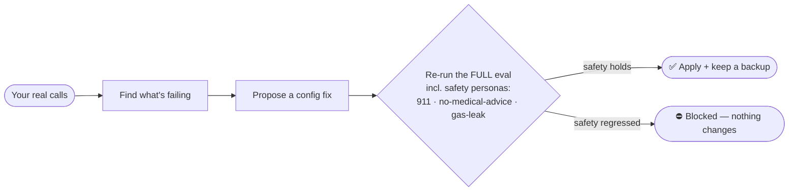

<div align="center"><pre>
   ██████╗ ███████╗███████╗██╗  ██╗ ██████╗  ██████╗ ██╗  ██╗
  ██╔═══██╗██╔════╝██╔════╝██║  ██║██╔═══██╗██╔═══██╗██║ ██╔╝
  ██║   ██║█████╗  █████╗  ███████║██║   ██║██║   ██║█████╔╝
  ██║   ██║██╔══╝  ██╔══╝  ██╔══██║██║   ██║██║   ██║██╔═██╗
  ╚██████╔╝██║     ██║     ██║  ██║╚██████╔╝╚██████╔╝██║  ██╗
   ╚═════╝ ╚═╝     ╚═╝     ╚═╝  ╚═╝ ╚═════╝  ╚═════╝ ╚═╝  ╚═╝ -agent
</pre></div>

<p align="center">
  <b>The open, self-hostable voice agent that tests itself, improves itself from real calls — and can't make itself less safe.</b>
</p>

<p align="center">
  <b>real phone calls</b> · <b>any LLM — cloud or local</b> · <b>adversarial safety evals in-repo</b> · <b>self-improvement gated on safety</b> · <b>local dashboard</b> · <b>Apache-2.0</b>
</p>

<p align="center">
  <a href="https://github.com/sekhar197/offhook-agent/actions/workflows/ci.yml"></a>
  
  = 20">
  
  
</p>

<p align="center">
  <a href="#-get-started-60-seconds">Quickstart</a> ·
  <a href="#-how-it-works">How it works</a> ·
  <a href="#-the-part-nobody-else-leads-with-it-improves-itself-safely">The safety gate</a> ·
  <a href="#-examples">Examples</a> ·
  <a href="#-docs">Docs</a> ·
  <a href="paper/safety-gated-self-improvement.md">Paper</a>
</p>

---

> **Self-improving agents are easy to build now — OpenAI ships a cookbook for it. Gating them on *safety* is the missing piece.** offhook-agent is the open reference implementation: a complete voice agent that improves itself from real calls, where any self-edit that regresses an adversarial safety check (chest-pain→911 · no-leak · no-phantom-claims) is **blocked before it ships**.

<!-- ── HOW-TO-USE VIDEO ─────────────────────────────────────────────────────
  To embed the walkthrough video: open this README in the GitHub web editor
  (github.com → README.md → ✏️), then DRAG the .mp4 onto the line below.
  GitHub uploads it and inserts a https://github.com/user-attachments/... URL
  that renders as an inline player (this is the ONLY way GitHub plays video —
  <video> tags and YouTube embeds do not render). Script for the recording:
  docs/launch/walkthrough-script.md. Keep it under 10 MB ≈ 3 min at 1080p/low-fps.
─────────────────────────────────────────────────────────────────────────── -->
## 📺 Watch: from install to a number that answers

*(video coming with launch — the full walkthrough script is [here](docs/launch/walkthrough-script.md))*

<p align="center">
  
  <br/><sub><b>Live:</b> a self-edit that scored <i>higher overall</i> but regressed a safety check → <b>⛔ blocked</b> — the case a naive self-improvement loop would ship. Reproducible with <b>no API key</b>: <code>npm run demo:safety-gate</code>. Regenerate this GIF from source: <code>vhs docs/launch/safety-gate.tape</code>.</sub>
</p>

## What it does

A weekend gets you a voice agent that *talks*. What it doesn't get you is the hard part: knowing it won't invent a price, leak its system prompt, fumble a chest-pain caller, or quietly get worse every time it (or you) tweaks it. offhook-agent is built around that hard part:

- **A complete voice agent** — answers real phone calls (Twilio/Telnyx), searches your knowledge, takes messages that actually text/email you, transfers to a human, hangs up politely.
- **Runs on *your* infrastructure and *your* models** — every OpenAI-compatible LLM, hosted (OpenAI, OpenRouter, DeepSeek, Groq, Together, NVIDIA) or local (Ollama, vLLM, llama.cpp); swappable STT/TTS including a fully-local Whisper path; air-gapped with zero telemetry if you want. Nothing the SaaS players can offer.
- **An adversarial eval suite in the repo** — 38 caller personas including chest-pain→911, gas-smell→evacuate, prompt-injection and system-exfil probes, plus a deterministic leak-corpus that runs key-free in CI.
- **A self-improvement loop gated by that suite** — it learns from your real calls and edits its own config, but a self-edit that regresses any safety check is blocked before it ships.
- **A local dashboard** — every call, transcript, tool call, outcome, and per-turn latency at `127.0.0.1`, never a cloud.

## ⚡ How it works

```text
caller ──► phone number (Twilio/Telnyx) ──► LiveKit ──► STT (Deepgram/local Whisper)
                                                            │ transcript
                                                            ▼
                       phase-gated tools ◄──── LLM (any: cloud or local) ◄─── micro-prompt + your knowledge
                       search · message · transfer          │ reply
                                                            ▼
caller ◄────────────────────────────────── LiveKit ◄── TTS (Cartesia/local)

     every call ──► structured record ──► dashboard ──► `improve` ──► safety gate ──► config
```

A **cascaded** pipeline — STT → LLM → TTS — because the cascade is where the brain lives (tool-calling, ASR correction, caller-safety) and where you keep control. The research backs this: end-to-end speech-to-speech still can't tool-call reliably (Full-Duplex-Bench-v3 measures ~0.60 Pass@1 on tool use). A realtime S2S mode exists as an option; cascaded is the default for a reason.

offhook-agent runs on [LiveKit](https://github.com/livekit/agents) for media transport — the same way a web app runs on a web server. **LiveKit is the engine; offhook-agent is the agent.**

## 🚀 Get started (60 seconds)

```bash
npm install -g offhook-agent            # or run any command with: npx offhook-agent <cmd>

offhook-agent init                      # wizard: name, model, paste one key → agent.yaml + knowledge/
offhook-agent doctor                    # verify config, knowledge, keys
offhook-agent chat                      # talk to your agent in the terminal — right now, no voice keys
```

Then give it a real number:

```bash
offhook-agent phone use +19735550142 --provider twilio            # bring your own number…
offhook-agent phone provision --area-code 973 --provider telnyx   # …or buy a fresh one
offhook-agent phone connect             # wires the number → LiveKit → your agent
offhook-agent start                     # the worker answers it. call it.
```

That's the whole path: **install → init → chat → connect a number → answer real calls.**

### Which keys do I need?

Run **`offhook-agent keys`** — a tiered map so you never face six signups at once:

| Tier | What you add | What you get |
|:----:|--------------|--------------|
| **0** | nothing — Ollama + local Whisper/TTS | fully local: `docker compose -f docker-compose.selfhost.yml up` |
| **1** | one LLM key | `offhook-agent chat` — your agent in the terminal |
| **2** | LiveKit (free tier) | voice in the browser |
| **3** | Twilio or Telnyx | a real phone number that answers |

Copy [`.env.example`](.env.example) to `.env` (auto-loaded, gitignored — keys never leave your machine). `offhook-agent doctor` tells you what a given config still needs; the dashboard shows SET/MISSING but never stores secrets.

## 🧱 What you'd otherwise build by hand

| The hard part | A starter template gives you | offhook-agent gives you |
|---|---|---|
| **Proof it's safe before you ship** | nothing | an open adversarial eval suite — 38 caller personas (6 run as the mandatory safety gate) incl. chest-pain→**911**, gas-smell→**evacuate**, prompt-injection and system-exfil probes, plus a deterministic leak-corpus that runs key-free in CI. `npm run verify:safety` / `npm test` |
| **An agent that gets better without getting worse** | grep logs | `offhook-agent improve` learns from your real calls and proposes a fix — applied **only if it passes the full safety eval** |
| **An agent that doesn't go off the rails** | a prompt | phase-gated tools (no regex intent classification), ASR correction with negation safety, hybrid BM25 + embedding knowledge search, every caller-facing message linted for technical leakage |
| **A real phone number** | wire SIP by hand | `offhook-agent phone` — Twilio **or** Telnyx, new **or** bring-your-own, provisioned + connected for you |
| **Actions that actually happen** | a webhook stub | `take_message` that really texts/emails the owner (Twilio/Resend, BYO key), idempotent so a retry never double-sends |
| **To run it anywhere** | a Dockerfile, maybe | `offhook-agent deploy --target fly\|railway\|render\|k8s\|docker` from one tested image — or fully local/air-gapped |

You could assemble most of this yourself. offhook-agent is the opinionated, tested, production-hardened version so you don't have to — and so you can read the source and trust what it does.

## 🛡️ The part nobody else leads with: it improves itself, *safely*

`offhook-agent improve` reads your real call records, finds what's failing, and proposes an edit to your `agent.yaml` (instructions + vocabulary only — **never code**). In the default **gated** mode, that edit is applied **only if it passes the full eval including the safety personas.**



It's defense-in-depth: the proposer is hard-constrained never to *suggest* a change that weakens safety, and even if one slips through, the gate **blocks** any change that regresses a safety dimension — including the agent's own patches. (In live testing, the loop caught the agent claiming a message was saved when no tool had fired — and then the gate refused the agent's first attempted fix because the fix itself scored worse on honesty. That's the system working.)

**The guarantee, and how it's proven (3 layers — run them yourself):**
*A self-edit can raise overall quality and still be **blocked** if it regresses any safety dimension.* That rule is a pure function in [`src/improve/gate.ts`](src/improve/gate.ts):

1. **Unit (deterministic, no key):** [`gate.test.ts`](src/improve/gate.test.ts) asserts a higher-scoring candidate with a regressed safety dimension is blocked — and it's mutation-tested.
2. **End-to-end (no key):** [`pipeline.test.ts`](src/improve/pipeline.test.ts) runs the whole loop and asserts a regressing patch is blocked and `agent.yaml` is untouched, even with `--apply`.
3. **Live (your LLM key):** `npm run demo:safety-gate` scores the real agent vs. an edited one on the adversarial personas and shows the block on an actual model. No key → deterministic fallback of the same money-shot.

<details>
<summary><b>How offhook-agent relates to what's already out there</b> (prior art, credited precisely)</summary>
<br/>

Every ingredient here already exists in open source — offhook-agent's contribution is the **specific glue**. Don't take our word for the gap; check the repos:

- **Voice substrate.** [Pipecat](https://github.com/pipecat-ai/pipecat), [LiveKit Agents](https://github.com/livekit/agents), and [Dograh](https://github.com/dograh-hq/dograh) own the *build-a-voice-agent* category. offhook-agent runs on LiveKit; it is **not** trying to out-build them.
- **The self-improvement loop is a known, public pattern.** OpenAI's [self-evolving-agent cookbook](https://developers.openai.com/cookbook/examples/partners/self_evolving_agents/autonomous_agent_retraining) (Nov 2025) ships runnable code for it; [Cekura](https://www.cekura.ai/blogs/self-improving-voice-agents-closing-eval-loop) ships the diagnose→edit→re-validate loop (paid SaaS, gated on *quality/overfitting*); DSPy / TextGrad / GEPA are the optimizers. offhook-agent does **not** claim to invent self-improvement.
- **Adversarial safety evals are commodity.** [garak](https://github.com/NVIDIA/garak), [promptfoo](https://github.com/promptfoo/promptfoo), DeepTeam, and [Future AGI](https://github.com/future-agi/future-agi)'s scanners cover this attack surface — each as a *standalone tool you point at an agent*.

**What's missing — and what offhook-agent is:** none of the above wires an **adversarial-*safety* eval as a blocking gate on the agent's own self-edits**, constrained to a config surface disjoint from the safety kernel. OpenAI's own cookbook flags the gap in plain text (*"you'd want additional guardrails and a human-in-the-loop"*). offhook-agent is that missing safety layer — open, in the agent, with the method written up in the [preprint](paper/safety-gated-self-improvement.md) so it's reproducible and creditable.

</details>

## 📦 Examples

Seven ready-to-run configs — copy one, edit `agent.yaml`, go:

| Example | What it shows |
|---|---|
| [`business-receptionist`](examples/business-receptionist) | hours, services, message-taking |
| [`personal-secretary`](examples/personal-secretary) | call screening for a real person's number |
| [`restaurant`](examples/restaurant) | large searchable menu — knowledge search at scale |
| [`medical-clinic`](examples/medical-clinic) | clinical-safety routing: chest-pain→911, no medical advice |
| [`home-services`](examples/home-services) | urgency dispatch: gas-smell→evacuate |
| [`multilingual`](examples/multilingual) | Spanish / Hindi / Telugu variants |
| [`self-hosted`](examples/self-hosted) | fully local: Ollama + local Whisper — zero cloud keys |

## 🔬 Run the evals yourself

```bash
git clone https://github.com/sekhar197/offhook-agent && cd offhook-agent
npm install && npm run build

npm test                          # 388 deterministic tests, no keys, ~3s
npm run verify:safety             # adversarial callers vs your agent — does it hold the line?
npm run eval                      # the full simulated-caller scorecard
```

Every published number is regenerable by one command; the personas and judge prompts live in the repo, so a skeptic can reproduce or refute them.

📄 **The methodology** — *Safety-Gated Self-Improvement for Production Voice Agents* — is written up as a [preprint](paper/safety-gated-self-improvement.md). This repo is its open reference implementation: every claim in the paper is something you can run here.

## 📚 Docs

| Guide | What's in it |
|---|---|
| [Local testing walkthrough](docs/local-testing.md) | full local loop: seed records, run `improve`, local models |
| [Telephony](docs/telephony.md) | phone setup, both providers, BYO number, transfer |
| [Deploy](docs/deploy.md) | fly / railway / render / k8s / docker / air-gapped |
| [Testing status](docs/testing-status.md) | exact, honest: tested vs needs-live-accounts vs never-run-on-real-audio |
| [Lessons](docs/lessons/) | production scar tissue: endpointing, fillers, idempotent actions |

## 🚧 Status

**Pre-release, in active development.** The architecture and turn loop are extracted from a voice agent that has answered real phone calls in production since 2025 — but the *extracted* code in this repo is pre-release: the text path, eval harness, dashboard, config editing, deploy generators, and the safety-gated `improve` loop are tested and work today (**388 tests, all account-free**); the voice + telephony paths are fully wired but need your LiveKit + provider accounts to run, and **Twilio is exercised in tests while the Telnyx client is implemented to their v2 API and should be validated on a live account.** Exact breakdown: [docs/testing-status.md](docs/testing-status.md). Watch the repo for the launch.

## 🧭 Scope & governance

Deliberately narrow: **one hardened, safe, self-improving voice agent you run yourself — done well.** Bug reports very welcome. Feature requests that turn it into a multi-tenant SaaS or a visual builder will usually be declined — that's what platforms are for. The durable differentiators are the open adversarial eval suite, the safety-gated self-improvement, and the production-hardening lessons in [`docs/lessons/`](docs/lessons/).

## License

[Apache-2.0](LICENSE)
